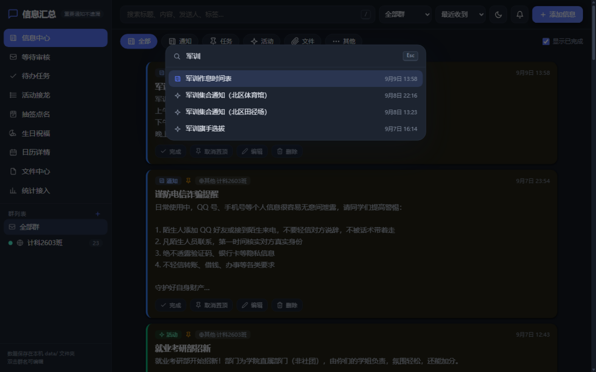
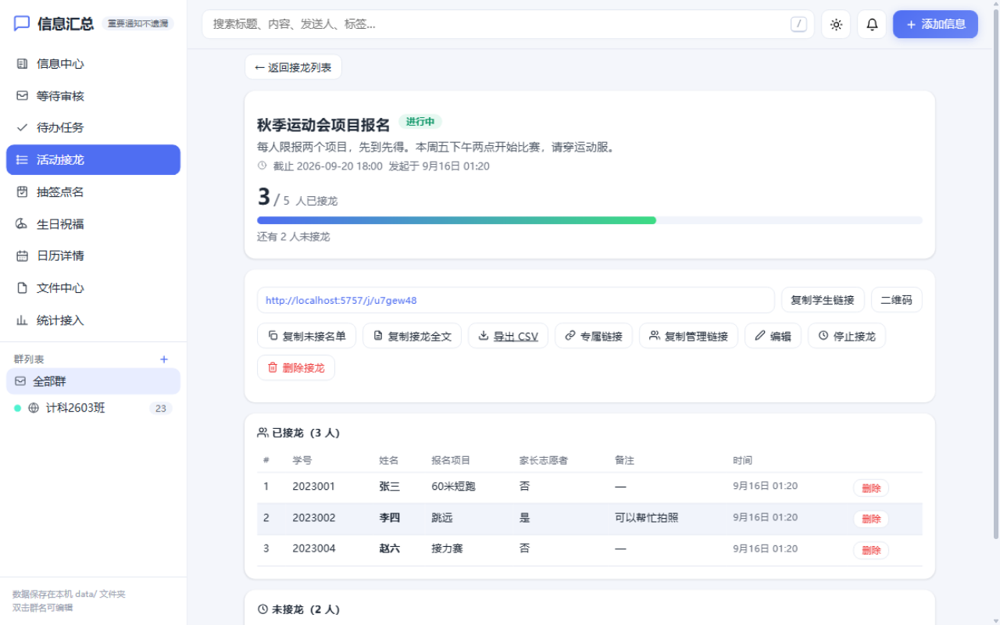
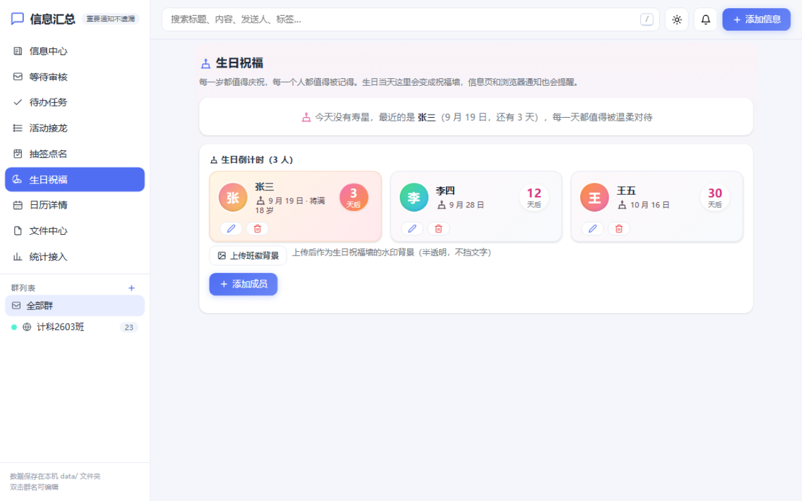

<div align="center">


# 信息汇总 InfoHub

**把班级群里的通知、任务、接龙、抽签、生日，汇成一个温暖的看板。**

零依赖 · 本地自持 · 手机电脑都能用 · 一条命令启动

[功能一览](#-功能一览) · [快速开始](#-快速开始) · [部署](#-部署) · [QQ 机器人](#-qq-机器人接入onebot-11) · [API](#-api-一览) · [FAQ](#-faq)

[](https://github.com/hsiwf/infohub/actions/workflows/ci.yml)
[](https://github.com/hsiwf/infohub/releases/latest)


[](https://github.com/hsiwf/infohub/pulls)

[下载最新版](https://github.com/hsiwf/infohub/releases/latest) · [问题反馈](https://github.com/hsiwf/infohub/issues)

**为什么做它？** 班级群消息刷屏、重要通知被淹没、活动报名靠刷屏接龙、生日没人记得——
InfoHub 把这些搬到一个本地网页：老师发通知、同学点链接报名、生日自动提醒，数据全部存在自己电脑上。

| 信息中心（浅色） | 命令面板 `Ctrl/⌘+K`（深色） |
| --- | --- |
|  |  |
| **活动接龙**：谁没接龙一目了然 | **生日祝福**：每一岁都值得庆祝 |
|  |  |

</div>

---

## ✨ 功能一览

| 模块 | 亮点 |
| --- | --- |
| 📨 **信息中心** | 通知 / 任务 / 活动分色看板，置顶、完成勾选、优先级、全文搜索、按截止时间排序 |
| ✅ **待办任务** | 按"已逾期 / 今天 / 未来 7 天"自动分桶，一键导出手机日历（.ics）、打印清单 |
| 🐉 **活动接龙** | 生成链接发到班群，同学点开即填即交（无需注册）；粘贴班级名单自动比对，**谁没接龙一目了然**；重名按学号区分、名单外标记、专属链接防代填、未接名单一键提醒、导出 CSV、扫码接龙、管理权委托给班委 |
| 🎲 **抽签点名** | 按班级名单抽 N 人——抽过的自动排除、下次不再被抽到，箱内抽空自动开新一轮；自定义人数、撤销、重置、历史留痕 |
| 🎂 **生日祝福** | 全班生日倒计时贺卡墙；生日当天专属祝福卡 + 信息页横幅 + 浏览器通知 + 导航弹跳角标；一键复制祝福发班群；支持班徽水印背景 |
| 📋 **班级名单库** | 名单保存一份，接龙、抽签、生日到处复用；支持"学号 姓名"解析与实时预览 |
| 🤖 **QQ 机器人** | OneBot 11 接入（NapCat / LLOneBot 等），群消息自动进站；人工审核 / 自动收录两种模式，防闲聊过滤、群白名单、HMAC 签名校验 |
| ⌨️ **命令面板** | `Ctrl/⌘+K` 唤起：视图跳转、常用操作、信息实时搜索；配套全套键盘快捷键（按 `?` 查看） |
| 📁 **文件中心** | 图片 / PDF 在线预览，附件阅读 / 下载次数统计 |
| 📊 **统计接入** | 信息看板、即将截止提醒、分类与群信息量统计、Webhook 接入地址 |
| 💾 **省心备份** | 每天自动备份数据库（保留 14 份）、JSON 一键导出 / 导入；数据全部存在本机 `data/` 文件夹 |
| 🌗 **三档外观** | 浅色 / 深色 / **按时间自动**（19:00–次日 7:00 深色），全站适配深色模式 |

**安全模型**：所有人可浏览，增删改需管理员登录（可选密码）；机器人凭令牌接入。公网部署务必设置密码。

---

## 🚀 快速开始

唯一的前置条件：**Node.js ≥ 22.5**（使用内置 SQLite，无需 `npm install`）。

```bash
git clone https://github.com/hsiwf/infohub.git
cd infohub
node server.js
```

打开 <http://localhost:5757> 即可使用。首次启动自动创建 `data/` 目录与配置文件。

**局域网访问**：启动日志会打印局域网地址（如 `http://192.168.x.x:5757`），手机连同一 Wi-Fi 直接打开；Windows 首次启动在防火墙弹窗勾选"允许访问专用网络"。

**可选配置**（`data/config.json`，改后重启生效）：

| 字段 | 说明 |
| --- | --- |
| `password` | 管理密码。留空 = 不启用；设置后所有人可浏览，增删改需登录（自带限速） |
| `ingestToken` | 外部接入令牌，供机器人 / 快捷指令调用 Webhook；泄露后改掉重启即可作废 |

<details>
<summary><b>让电脑开机就运行？</b></summary>

```bash
# pm2（Windows / macOS / Linux 通用）
npm install -g pm2
pm2 start server.js --name infohub
pm2 save && pm2 startup        # 开机自启
```

**Windows** 也可以用 [NSSM](https://nssm.cc/) 把 `node server.js` 注册为系统服务。

</details>

---

## 📦 部署

三种方式按场景三选一，1 核 1G 最低配云服务器即可，全程约 10 分钟。

<details open>
<summary><b>方式一：Linux 服务器 + systemd（推荐）</b></summary>

```bash
# 1. 安装 Node.js 22.5+
curl -fsSL https://deb.nodesource.com/setup_22.x | sudo -E bash -
sudo apt-get install -y nodejs

# 2. 获取代码
sudo mkdir -p /opt/infohub && sudo chown $USER /opt/infohub
git clone https://github.com/hsiwf/infohub.git /opt/infohub

# 3. 试运行并放行端口（云厂商安全组 + 本机防火墙均需放行 5757）
cd /opt/infohub && node server.js

# 4. 设置管理密码后注册系统服务
sudo tee /etc/systemd/system/infohub.service <<'UNIT'
[Unit]
Description=InfoHub 信息汇总
After=network.target

[Service]
WorkingDirectory=/opt/infohub
ExecStart=/usr/bin/node server.js
Environment=PORT=5757
Restart=on-failure
RestartSec=5
User=www-data

[Install]
WantedBy=multi-user.target
UNIT
sudo chown -R www-data /opt/infohub/data
sudo systemctl daemon-reload
sudo systemctl enable --now infohub
```

**日常维护**：日志 `journalctl -u infohub -f` 或 `data/logs/server.log`；升级 `git pull && sudo systemctl restart infohub`；备份直接拷 `data/` 文件夹。

</details>

<details>
<summary><b>方式二：宝塔面板（图形界面）</b></summary>

1. 软件商店安装 **Node.js 版本管理器** → 安装 22.x（须 ≥ 22.5）
2. 文件 → 新建 `/www/wwwroot/infohub` → 上传源码（**不要上传本地 data/ 目录**）
3. 网站 → Node 项目 → 添加：项目目录 `/www/wwwroot/infohub`、启动文件 `server.js`、端口 `5757`，勾选守护进程
4. 放行端口 5757（面板 + 云厂商安全组），访问 `http://服务器IP:5757` 验证
5. 可选：绑定域名 + Let's Encrypt 证书（PWA 安装等浏览器能力要求 HTTPS）

</details>

<details>
<summary><b>方式三：Docker</b></summary>

```bash
docker build -t infohub .
docker run -d --name infohub -p 5757:5757 -v infohub-data:/app/data infohub
```

</details>

**Webhook 接入**（快捷指令 / 自动化程序）：

```bash
curl -X POST "http://localhost:5757/api/ingest?token=你的令牌" \
  -H "Content-Type: application/json" \
  -d '{"text":"张老师：下周一下午4点前交自学计划表","group":"三年级二班","sender":"张老师"}'
```

---

## 🤖 QQ 机器人接入（OneBot 11）

在电脑上用 [NapCat](https://napneko.github.io/) / LLOneBot / Lagrange / go-cqhttp 等 OneBot 11 框架登录一个 QQ 小号拉进班级群，网络配置里添加 **HTTP POST 上报**，群消息就会自动进站。

| 配置项 | 值 |
| --- | --- |
| 上报地址 | `http://你的服务器地址:5757/api/onebot/report` |
| access_token | `data/config.json` 的 `onebot.token`（默认与 `ingestToken` 相同） |

统计页「🐧 QQ 自动接入」面板会直接生成上报地址与 NapCat / LLOneBot 配置示例，一键复制。

- **两种收录模式**（`onebot.mode`）：`review` 人工审核（默认，先进「待审核」挑着收录）/ `auto` 自动收录
- **防闲聊过滤**（`onebot.filter`）：最短长度、水词屏蔽（内置"收到""好的"等）、关键词白名单、仅群主/管理员发言、智能过滤；后三项仅 auto 模式参与
- 群白名单按 `ext_key` 绑定站内群，改群名不丢关联；群文件上传自动记录；纯图片/表情不收录；5 分钟内重复上报自动去重
- 可启用 `onebot.secret` 改用 HMAC 签名校验

---

## 🐉 活动接龙

侧栏「🐉 活动接龙」发起接龙：填标题、粘贴班级名单（Excel / QQ 名单直接粘贴，自动识别"学号 姓名"），生成链接发到班群。

- **同学端**：打开链接或扫二维码 → 输入学号或姓名（联想匹配，重名从下拉选择）→ 填写提交。无需注册，重新提交即覆盖；页面实时显示已接 / 未接与截止倒计时
- **自动统计**：按名单"槽位"统计（学号+姓名唯一确定一人，重名各归各的）；名单外提交单独标记；编辑名单后已接记录自动重新匹配
- **管理台**：未接名单一键复制提醒文案、复制仿群接龙全文、导出 CSV（Excel 直接打开）、每人一条专属链接（打开后姓名锁定，防代填）、随时编辑 / 停止 / 删除
- **委托管理**：复制管理链接发给班委，无需管理员密码即可代管这一个接龙

---

## 🎲 抽签点名

活动缺人？按班级名单建签箱抽签决定：

- **公平轮抽**：抽过的人自动排除，下次不会被抽到；箱内抽空自动开新一轮，全班人人有份
- 每次抽几人随时可改；每轮结果留痕可回溯；抽错可撤销上一轮或一键重置箱子
- Fisher-Yates 洗牌 + `crypto.randomInt` 无偏随机；抽签是管理操作，同学可在页面看到结果

---

## 🎂 生日祝福

让班级更有温度：成员生日倒计时 + 当天祝福提醒。生日面前人人平等——不分老师、同学，每一位成员都同样被庆祝。

- **生日倒计时贺卡墙**：按天数排序的彩色贺卡，7 天内高亮
- **当天祝福墙**：极光渐变背景 + 彩旗 + 气球彩带动画 + 衬线发光名字 + 祝福语；一键复制祝福发到班群
- **不错过**：信息页顶部生日横幅、浏览器通知（当天一次）、导航 🎂 弹跳角标
- **班徽背景**：上传班级徽章作为祝福墙半透明水印，凸显班级认同
- 生日只存月日，年份选填（填了显示"将满 N 岁"）；2 月 29 日平年按 2 月 28 日庆祝

侧栏「🎂 生日祝福」→ 从名单库导入 → 补填生日，剩下的交给 InfoHub。

---

## 🌗 外观主题

顶栏 🌙 按钮三档循环：**浅色 → 深色 → 自动**。

- **自动**（默认）：19:00–次日 7:00 自动使用深色，其余浅色，页面开着跨过时间点也会自动切换
- 手动选择浅色 / 深色后固定不变；选择保存在本浏览器
- 学生接龙页、快捷录入页跟随同一主题设置

---

## 🔌 API 一览

<details>
<summary><b>查看完整 API 列表</b></summary>

| 方法 | 路径 | 说明 |
| --- | --- | --- |
| GET | `/api/health` | 健康检查 |
| GET / POST | `/api/messages` | 信息列表（`q` / `group_id` / `category` / `status` / `sort` / `due` / 分页）/ 新增 |
| GET / PUT / DELETE | `/api/messages/:id` | 详情 / 修改 / 删除（含附件文件） |
| POST | `/api/messages/:id/toggle` · `/pin` | 切换完成 / 置顶 |
| GET / POST | `/api/groups` | 群列表（`withCounts=1` 带数量）/ 新增（同名 409） |
| PUT / DELETE | `/api/groups/:id` | 修改 / 删除群（群下信息保留） |
| POST | `/api/upload` | 上传附件（multipart/form-data，需 `message_id`） |
| GET | `/api/attachments/:id/download` · `:raw` | 下载附件（`?dl=1` 强制下载；阅读/下载计数） |
| DELETE | `/api/attachments/:id` | 删除附件 |
| GET | `/api/files` | 附件列表（含阅读 / 下载统计） |
| POST | `/api/parse` | 智能解析文本（不落库） |
| POST | `/api/similar` | 相似信息检测（防重复录入） |
| POST | `/api/ingest?token=` | 外部接入 Webhook |
| POST | `/api/onebot/report` | OneBot 11 HTTP POST 上报（QQ 机器人） |
| GET / POST / PUT / DELETE | `/api/jielong*` | 接龙 CRUD / 学生提交 / 停止 / 记录删除 / CSV 导出 |
| GET / POST / PUT / DELETE | `/api/draw*` | 抽签签箱 CRUD / 抽签 / 撤销 / 重置 |
| GET / POST / DELETE | `/api/rosters*` | 班级名单库 |
| GET / POST / PUT / DELETE | `/api/birthdays*` | 生日成员 CRUD / 名单导入 |
| GET / POST / DELETE | `/api/class-badge` | 班徽背景（上传 / 访问 / 移除） |
| GET | `/api/inbox` | 待审核收件箱列表（仅管理员） |
| POST | `/api/inbox/:id/accept`、`/api/inbox/accept-all` | 收录待审核消息 |
| DELETE | `/api/inbox/:id`、`/api/inbox` | 忽略待审核消息 |
| GET | `/api/calendar.ics` | 导出截止提醒日历（只含未逾期事项） |
| GET | `/api/export` | 导出 JSON 备份（含附件记录、接龙、抽签、名单库、生日） |
| POST | `/api/import?force=1` | 导入 JSON 备份（仅空库时允许，事务保护） |
| GET | `/api/stats` | 统计数据 |
| POST | `/api/login` / `/api/logout` | 管理员登录 / 登出 |

所有响应均为 JSON；写入类接口在设置了管理密码后需要登录会话或 `X-Token` 请求头。例外：接龙的学生提交、机器人上报永远开放；接龙管理凭该接龙的管理令牌 `?t=` 也可通行。

</details>

**环境变量**：`PORT`（默认 5757）· `INFOHUB_DEBUG=1`（打印 API 请求）· `INFOHUB_OPEN=1`（启动自动打开浏览器）

---

## 🧪 自检与开发

```bash
node test.js
```

脚本对全部 API 做端到端检查（支持无密码 / 密码两种部署形态），全部通过输出 PASS 汇总，任何一项失败以非零码退出，可用于 CI。

```
infohub/
├── server.js            # HTTP 服务与全部 API（零依赖）
├── db.js                # SQLite 初始化与表结构（node:sqlite）+ 老库迁移
├── lib/
│   ├── smartparse.js    # 中文通知智能解析（启发式规则）
│   ├── jielong.js       # 活动接龙：名单解析 / 身份匹配 / 进度 / CSV
│   └── multipart.js     # multipart/form-data 解析
├── public/              # 前端（原生 HTML / CSS / JS + PWA）
│   ├── index.html       # 主界面（信息 / 待审核 / 待办 / 接龙 / 抽签 / 生日 / 日历 / 文件 / 统计）
│   ├── jielong-join.html# 学生接龙页（/j/:id）
│   ├── quick.html       # 快捷录入页
│   ├── login.html       # 管理员登录页
│   └── js/app.js        # 前端逻辑
├── test.js              # 端到端自检脚本
└── data/                # 运行时生成：数据库、附件、备份、日志、config.json（不入库）
```

**贡献约定**：Fork 后新建分支；**保持零依赖原则**——不引入 npm 运行时依赖；提交前跑 `node test.js` 确保自检通过。

---

## ❓ FAQ

**端口被占用？** 大概率服务已在运行，直接打开 <http://localhost:5757>；或 `PORT=8080 node server.js` 换端口。

**手机 / 外网打不开？** 检查三处：同一 Wi-Fi、防火墙已放行端口、云服务器安全组已放行端口。

**忘记管理密码？** 编辑 `data/config.json`，将 `password` 改为 `""`（或新密码）后重启服务。

**如何彻底重置？** 停止服务后删除 `data/` 目录，重启即回到初始状态（先备份需要保留的内容）。

**智能解析不准？** 解析是纯启发式规则，识别结果永远可以在界面上手工修改；欢迎在 Issue 中贴出解析失败的例子。

---

## 🔐 数据与安全

- 所有数据都在本机 `data/` 文件夹——**复制整个文件夹即完整备份**（含数据库、附件、配置）
- 每天自动备份数据库到 `data/backups/`（保留 14 份）；JSON 导出 / 导入适合跨机器迁移
- **学生名单、生日属于敏感信息**：请勿公开 `data/` 目录；公网部署务必设置管理密码
- 机器人令牌（`ingestToken`）泄露后改掉重启即可作废旧令牌

---

## 🤝 参与贡献

欢迎 Issue 和 Pull Request：Fork 本仓库并新建分支；**保持零依赖原则**——不引入 npm 运行时依赖；提交前运行 `node test.js` 确保自检通过。详细流程见 [CONTRIBUTING.md](CONTRIBUTING.md)，更新记录见 [CHANGELOG.md](CHANGELOG.md)，安全问题请按 [SECURITY.md](SECURITY.md) 私下报告。

## 📄 许可证

本项目基于 [MIT License](LICENSE) 开源。
